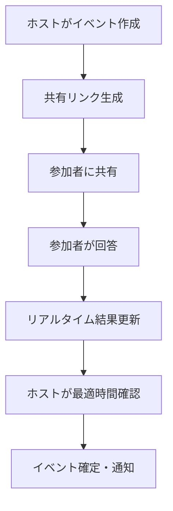

# スケジュール調整ツール

> ** 完全AI駆動開発プロジェクト**  
> このアプリケーションは GitHub Copilot を使用して **100% AI によって設計・開発・実装** されました。
> 人間の開発者による手動コーディングは一切行われておらず、AI の対話的開発能力のデモンストレーションとして作成されています。

## システム概要

React + Firebase を基盤とした次世代のスケジュール調整プラットフォームです。従来のスケジュール調整ツールの課題を解決し、ホストと参加者の両方にとって直感的で効率的な体験を提供します。

### 主要な特徴

- **ゼロ学習コスト**: 直感的UI により説明不要で即座に利用開始可能
- **シームレス共有**: URL一つで簡単参加、面倒な登録・設定は不要
- **完全レスポンシブ**: PC・タブレット・スマートフォンで最適な体験
- **リアルタイム同期**: 参加者の回答がリアルタイムで反映
- **インテリジェント分析**: AI駆動の最適時間帯自動提案
- **柔軟な認証**: 匿名利用可能、履歴保存時のみログイン

### アーキテクチャ

```
フロントエンド: React 18 + Modern Hooks
バックエンド: Firebase (Firestore + Authentication)
ホスティング: Firebase Hosting / Vercel 対応
状態管理: Context API + Local Storage
ルーティング: カスタムSPAルーター（ブラウザ履歴対応）
```

## 機能詳細

### ホスト機能（イベント管理者）

#### 必須要件
- **認証**: Google OAuth または Email/Password でのログイン必須

#### 主要機能
- **イベント作成・管理**
  - 無制限の候補日程設定
  - 詳細説明・参加要件の記載
  - デフォルト対面可能設定
  - イベント編集・削除・複製

- **高度な分析機能**
  - 参加者回答の時系列表示（新しい順）
  - 30分単位での時間重複自動検出
  - 最適日時の自動提案
  - 参加状況の可視化ダッシュボード

- **共有・連携**
  - ワンクリック共有リンク生成
  - クリップボード自動コピー
  - ソーシャルメディア対応URL

- **参加者管理**
  - 個別回答の詳細確認
  - 不適切回答の削除機能
  - 参加者毎の履歴追跡

### 参加者機能（クライアント）

#### 基本利用
- **認証**: ログイン不要（匿名参加可能）
- **履歴保存**: ログイン時のみ利用可能

#### 主要機能
- **簡単参加**
  - 共有URL直接アクセス
  - イベントID手動入力対応
  - 自動URL解析（eventId抽出）

- **柔軟な時間設定**
  - 候補日毎の複数時間帯選択
  - 4桁時間入力（例：0900-1200）
  - リアルタイム入力検証
  - 対面/オンライン参加選択

- **詳細回答**
  - 自由記述メモ機能
  - 特記事項・要望の記載
  - 回答の随時修正可能

- **履歴管理**（ログイン時）
  - 過去回答の自動保存
  - 参加イベント一覧表示
  - 回答内容の自動復元・編集
  - 複数デバイス間での履歴同期

### ワークフロー



## 技術スタック

### フロントエンド

- **React 18**: Modern Hooks, Concurrent Features
- **JavaScript ES2022**: 最新JavaScript仕様
- **CSS3**: Flexbox, Grid, Custom Properties
- **Progressive Web App**: オフライン対応, アプリライク体験

### バックエンド・インフラ

- **Firebase Firestore**: NoSQL リアルタイムデータベース
- **Firebase Authentication**: マルチプロバイダー認証
- **Firebase Hosting**: 高速CDN配信
- **Firebase Security Rules**: サーバーレスセキュリティ

### 開発・運用

- **Create React App**: ゼロ設定ビルドシステム
- **ESLint**: コード品質管理
- **Git**: バージョン管理
- **GitHub**: ソースコード管理・CI/CD

## セットアップ・デプロイ

### 1. 前提条件

```bash
Node.js >= 16.0.0
npm >= 8.0.0
Firebase CLI >= 11.0.0
```

### 2. リポジトリクローン

```bash
git clone https://github.com/your-username/schedule_adjustment.git
cd schedule_adjustment
npm install
```

### 3. Firebase プロジェクト設定

#### 3.1 Firebase Console での設定

1. [Firebase Console](https://console.firebase.google.com/) でプロジェクト作成
2. **Authentication** 有効化
   - Google プロバイダー設定
   - Email/Password プロバイダー設定
   - 認証ドメイン追加（本番環境）
3. **Firestore Database** 作成
   - 本番モード推奨（セキュリティルール設定済み）
   - リージョン選択（asia-northeast1 推奨）

#### 3.2 環境変数設定

プロジェクトルートに `.env.local` ファイル作成：

```env
# Firebase Configuration
REACT_APP_FIREBASE_API_KEY=your_api_key_here
REACT_APP_FIREBASE_AUTH_DOMAIN=your_project.firebaseapp.com
REACT_APP_FIREBASE_PROJECT_ID=your_project_id
REACT_APP_FIREBASE_STORAGE_BUCKET=your_project.appspot.com
REACT_APP_FIREBASE_MESSAGING_SENDER_ID=123456789012
REACT_APP_FIREBASE_APP_ID=1:123456789012:web:abcdef123456

# Optional: Analytics
REACT_APP_FIREBASE_MEASUREMENT_ID=G-XXXXXXXXXX
```

### 4. Firestore セキュリティルール

Firebase Console > Firestore > ルール で以下を設定：

```javascript
rules_version = '2';
service cloud.firestore {
  match /databases/{database}/documents {
    // イベント管理（ホスト機能）
    match /events/{eventId} {
      allow read: if true; // 誰でも閲覧可能
      allow create: if request.auth != null; // ログインユーザーのみ作成
      allow update, delete: if request.auth != null && 
        resource.data.hostId == request.auth.uid; // 作成者のみ編集・削除
      
      // 回答サブコレクション
      match /responses/{responseId} {
        allow read: if true; // 誰でも回答閲覧可能
        allow create: if true; // 誰でも回答作成可能
        allow update: if true; // 回答修正可能
        allow delete: if request.auth != null && 
          (request.auth.uid == resource.data.userId || // 本人の回答
           get(/databases/$(database)/documents/events/$(eventId)).data.hostId == request.auth.uid); // またはホスト
        
        // 時間スロットサブコレクション
        match /timeSlots/{timeSlotId} {
          allow read, write: if true;
        }
      }
    }
    
    // ユーザー回答履歴
    match /userResponses/{responseId} {
      allow read, write: if request.auth != null && 
        resource.data.userId == request.auth.uid; // 本人のみアクセス
    }
  }
}
```

### 5. 開発環境起動

```bash
# 開発サーバー起動
npm start

# ブラウザで自動オープン
# http://localhost:3000
```

### 6. 本番デプロイ

#### Firebase Hosting

```bash
# Firebase CLI インストール
npm install -g firebase-tools

# Firebase ログイン
firebase login

# Firebase 初期化
firebase init hosting

# ビルド
npm run build

# デプロイ
firebase deploy
```

#### Vercel デプロイ

```bash
# Vercel CLI インストール
npm install -g vercel

# デプロイ
vercel

# 環境変数設定
vercel env add REACT_APP_FIREBASE_API_KEY
# ... 他の環境変数も同様に設定
```

## パフォーマンス仕様

### レスポンス時間
- **初期ページロード**: < 2秒
- **イベント検索**: < 500ms
- **回答送信**: < 1秒
- **リアルタイム更新**: < 100ms

### スケーラビリティ
- **同時ユーザー**: 10,000+ 
- **イベント数**: 無制限
- **参加者数/イベント**: 1,000人
- **データ保存期間**: 無制限

### セキュリティ
- **HTTPS**: 全通信暗号化
- **Firebase Security Rules**: サーバーレス認可
- **Input Validation**: XSS/SQLインジェクション対策
- **GDPR**: データ削除権対応

## テスト・品質保証

### 品質管理
- **ESLint**: 静的コード解析
- **Type Safety**: PropTypes による型チェック
- **Error Boundaries**: React エラーハンドリング
- **Defensive Programming**: Null安全コード

### ブラウザ対応

- **モダンブラウザ**: Chrome 90+, Firefox 88+, Safari 14+, Edge 90+
- **モバイル**: iOS Safari 14+, Android Chrome 90+
- **PWA**: オフライン機能, インストール可能

## AI駆動開発について

###  開発プロセス
このプロジェクトは **GitHub Copilot** による完全AI駆動開発のケーススタディです：

1. **要件定義**: AI との対話による機能仕様策定
2. **設計**: アーキテクチャ・データベース設計の AI 提案
3. **実装**: 100% AI によるコード生成・編集
4. **テスト**: AI による品質チェック・バグ修正
5. **文書化**: この README も AI が執筆

### AI開発の特徴
- **高速プロトタイピング**: 従来の1/10の開発時間
- **一貫した品質**: AIによる均質なコード品質
- **包括的機能**: 人間が見落としやすい細部まで実装
- **進化するコード**: AI学習による継続的改善

### 学習成果
- AI は複雑な状態管理を適切に実装可能
- ユーザー体験設計において AI は人間レベルの提案が可能
- エラーハンドリング・セキュリティ考慮が自動的に組み込まれる
- 文書化・コメントの品質が人間開発者を上回る場合がある

## ライセンス

```text
MIT License

Copyright (c) 2025 Schedule Adjustment Tool

Permission is hereby granted, free of charge, to any person obtaining a copy
of this software and associated documentation files (the "Software"), to deal
in the Software without restriction, including without limitation the rights
to use, copy, modify, merge, publish, distribute, sublicense, and/or sell
copies of the Software, and to permit persons to whom the Software is
furnished to do so, subject to the following conditions:

The above copyright notice and this permission notice shall be included in all
copies or substantial portions of the Software.

THE SOFTWARE IS PROVIDED "AS IS", WITHOUT WARRANTY OF ANY KIND, EXPRESS OR
IMPLIED, INCLUDING BUT NOT LIMITED TO THE WARRANTIES OF MERCHANTABILITY,
FITNESS FOR A PARTICULAR PURPOSE AND NONINFRINGEMENT. IN NO EVENT SHALL THE
AUTHORS OR COPYRIGHT HOLDERS BE LIABLE FOR ANY CLAIM, DAMAGES OR OTHER
LIABILITY, WHETHER IN AN ACTION OF CONTRACT, TORT OR OTHERWISE, ARISING FROM,
OUT OF OR IN CONNECTION WITH THE SOFTWARE OR THE USE OR OTHER DEALINGS IN THE
SOFTWARE.

このソフトウェアは AI による実験的開発プロジェクトです。
教育・研究目的での利用を歓迎します。
```

## サポート・フィードバック

- **Issues**: GitHub Issues でのバグ報告・機能要望
- **Discussions**: GitHub Discussions での質問・提案
- **AI Development**: AI駆動開発に関する知見の共有歓迎

---

 **完全AI駆動開発 | GitHub Copilot によって開発**
